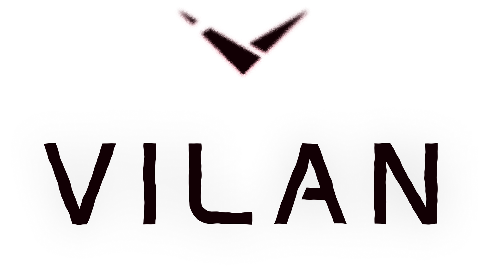

<p align="center">
  <picture>
    <source media="(prefers-color-scheme: dark)" srcset="assets/branding/light_lockup.png">
    
  </picture>
</p>

Vilan is a language for building full-stack web apps. It compiles to
JavaScript and runs on Node and in the browser, but it is not JavaScript:
values are copied instead of shared, there is no `null` and no exceptions,
`await` is implicit, and the compiler checks the things you usually find
out at runtime.

It ships as one coherent stack. The language, a standard library, a
fine-grained reactive UI layer, typed compile-time styling, an enum-based
router, a service layer where the server exposes live-synced state and
typed rpc methods from a single struct (no REST endpoints, schema files,
or client SDK to regenerate), and a dev loop to match: save a file and
the running browser app updates in place, reactive state intact.

> **Status: fast-moving alpha.** The language changes weekly and there are
> no stability promises yet. It is, however, real: the test suite holds
> ~3,700 tests, every example in the documentation is compiled by CI, the
> compiler front end is handwritten (a full build of the example client is
> ~0.2 s), and the repo contains a working full-stack example app.

## A taste

Reactive state, from the first page of the guide:

```vilan
import std::reactive::{ Signal, Owner, run_with_owner };

fun main() {
	let count = Signal::new(0);
	let owner = Owner::new();
	run_with_owner(owner, || {
		count.effect(|value: i32| print(value));
	});
	count.set(1);
	count.set(2);
}
```

And the full-stack model: one struct is the entire client/server
contract. Exposed signals mirror live to every connected client, and
`[rpc]` methods are callable remotely with typed results:

```vilan,fragment
[service(NotesClient)]
struct NotesStore {
	[expose] notes: SignalCell<List<Note>>,
	…
}

impl NotesStore {
	[rpc]
	fun add_note(self, token: str, title: str): i32 { … }
}

// browser side, inside a view:
let client = NotesClient::connect("/", json_codec())!;
let notes: SignalCell<List<Note>> = client.notes.or([]);   // live-synced, typed; subscribed while shown
```

The [full-stack walkthrough](vilan/docs/guide/walkthrough.md) builds a
working notes app (sign-in, live sync between windows, an editor that
saves as you type) in about 500 lines, and that app lives in
[`vilan/examples/walkthrough/`](vilan/examples/walkthrough/) where the
test suite builds it on every run.

## Why it feels different

- **Values copy.** Assigning or passing data gives the receiver its own
  copy. Sharing is explicit and typed, so a whole class of
  spooky-action-at-a-distance bugs doesn't exist.
- **One law behind the memory model.** Every alias is a claim on an owner;
  views are the statically-proven claims, handles the checked ones. A
  `resource` (a database handle, a task nursery) has exactly one owner and
  cleans up deterministically at scope end, with the double-close family
  rejected at compile time.
- **No `null`, no exceptions.** Absence is `Option`, failure is `Result`,
  and the `!`, `?.` and `?` operators keep both ergonomic.
- **`await` is implicit.** Calling an async function gives you the
  value. You only write `async` to *opt out* of waiting.
- **Fine-grained reactive UI.** Signals bind to individual DOM
  properties. No virtual DOM, no re-renders, and cleanup is automatic by
  construction.
- **The wire is checked.** Payload types derive `Wire`; client and server
  compare a contract hash at connect; mirrors resync themselves after
  reconnects.
- **The loop is hot.** `vilan run --watch` rebuilds in a fraction of a
  second, hot-swaps the browser with module state carried across, shows
  compile errors in-page, and restarts the server leg while the client
  reconnects on its own.
- **Docs that can't rot.** Every example in the book is compiled by the
  test suite.

## Getting started

Install the toolchain (Linux, macOS, or Windows; you'll also need
[Node](https://nodejs.org) to run what you build). On Linux and macOS:

```sh
curl -fsSL https://github.com/vilan-lang/vilan/releases/latest/download/install.sh | sh
```

and on Windows, in PowerShell:

```powershell
irm https://github.com/vilan-lang/vilan/releases/latest/download/install.ps1 | iex
```

That puts `vilan` and `vilan-lsp` in `~/.vilan/bin` (on Windows,
`%USERPROFILE%\.vilan\bin`). The unix script prints the PATH line to add;
the PowerShell one adds the directory to your user PATH itself, so open a
new terminal afterwards. Update any time with `vilan upgrade` (it only touches the
network when you run it). Each [release](https://github.com/vilan-lang/vilan/releases)
also carries `vilan-vscode.vsix`, the VS Code extension: highlighting,
diagnostics, hover with docs on everything (keywords included),
go-to-definition, rename, call-shaped completion with signatures, inlay
hints, semantic tokens, Organize Imports, and a formatter. All of it
keeps working while the file has errors. Install it via "Extensions:
Install from VSIX".

Or build the project from source (Rust required) with:

```sh
git clone https://github.com/vilan-lang/vilan
cd vilan
cargo install --path crates/vilan-cli   # installs the `vilan` binary
```

Then put this in `hello.vl`:

```vilan
fun main() {
	print("hello");
}
```

and run it:

```sh
vilan run hello.vl
```

For a whole project rather than a file, `vilan init` scaffolds one that
already compiles (a manifest, sources, and a `.gitignore`):

```sh
vilan init my-app --template fullstack   # or node, or browser
cd my-app
vilan run .
```

For a full-stack project, `vilan run --watch .` is the whole dev loop
(rebuild, hot-swap the browser, restart the server), described in
[the dev-loop guide](vilan/docs/guide/dev-loop.md).

From there, read the book. It starts with
[Coming from JavaScript](vilan/docs/tour/coming-from-javascript.md) and
ends with the full-stack walkthrough:

- **Rendered** (search + sidebar): https://vilan-lang.org/docs/
  (or locally, `cargo install mdbook --version 0.5.4 --locked && mdbook serve
  vilan/docs` — the renderer is pinned, see `vilan/docs/README.md`).
- **As files**: start at [vilan/docs/README.md](vilan/docs/README.md).
- **What changed**: the [changelog](CHANGELOG.md), one section per release.

## Repository structure

```
crates/
  vilan-core/          the compiler: lexer → parser → analyzer → transformer
  vilan-cli/           the `vilan` binary (init / build / check / run / fmt / test / upgrade)
  vilan-lsp/           the language server
  vilan-embedded-std/  embeds the std source into the installed binary
  vilan-wasm/          the compiler as WebAssembly — the web playground's engine
editors/vscode/        the VS Code extension (grammar + LSP client)
homebrew/              the Homebrew formula's generator + a pinned seed copy (the live tap is regenerated by release CI)
npm/                   the npm channel's package sources, assembled into six packages by release CI
vilan/
  std/                 the standard library, written in Vilan
  docs/                the book: tour, guides, reference, spec (mdBook)
  examples/            runnable examples, incl. the walkthrough app
  test/                the codegen corpus (byte-identical golden files)
  proposal/            design documents — how and why things were built
.github/               CI: the test matrix + the release pipeline
```

## AI stance

See [AI_STANCE.md](AI_STANCE.md).
The short of it is that AI tools have been used extensively for _implementation_,
but not _design_. Vilan is a for-human language and always will be.
Had I the resources, Vilan's compiler would be primarily written by hand.

## Development

```sh
cargo test    # the whole suite: compiler, corpus, docs gate, e2e
```

Four test layers keep the project honest: unit and behavior pins in
`crates/vilan-core/tests/`, a golden-file codegen corpus in `vilan/test/`
(byte-identical, deliberately), the docs gate, which extracts and
compiles every fenced example in `vilan/docs/`, including the ones on
this page, and an examples gate, which builds every project under
`vilan/examples/` from a clean copy of its tracked files.

## License

Licensed under either of

- Apache License, Version 2.0 ([LICENSE-APACHE](LICENSE-APACHE))
- MIT license ([LICENSE-MIT](LICENSE-MIT))

at your option.

The Vilan logo, wordmark, and the other brand assets under
[assets/branding/](assets/branding/) are excluded from the above and are
covered by [their own license](assets/branding/LICENSE) instead.

Unless you explicitly state otherwise, any contribution intentionally
submitted for inclusion in Vilan by you, as defined in the Apache-2.0
license, shall be dual licensed as above, without any additional terms
or conditions.
